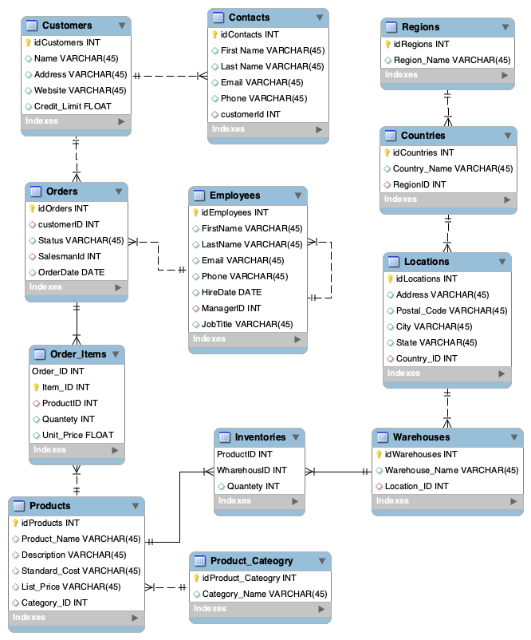

# Introduction

We assume that you have a basic SQL knowledge to run the following DDL/DML instructions.
For further references, please visit [SQL Intro](https://www.w3schools.com/sql/sql_intro.asp). Keep in mind that some of the instructions may vary depending on the DBMS vendor. Check the vendor documentation before proceding with the database implementation.
For the purpose of this lab, we will use [MySQL Server](https://dev.mysql.com/doc/)

# Requirements

1. [Docker](https://docs.docker.com/engine/install/)
2. [MySQL Workbench](https://www.mysql.com/products/workbench/) *Optional*
3. Basic SQL Knowledge

## Running MySQL with Docker

```
docker run --name some-mysql -v /my/own/datadir:/var/lib/mysql -e MYSQL_ROOT_PASSWORD=my-secret-pw -d mysql:tag
```
Now we are ready to start with the lab.

# Lab 1

## Create Table

As part of this Lab you will create a database from a business requirement.


## Business Requirement
Your organization requires to build the persistency layer using MySQL as your DBMS.
The Enterprise Architect shared the following Entity Relationship Diagram and asked you to build the database.




## Exercise

Build the database using Data Definition Language (DDL).

Refer to the below example for this use case.

```
CREATE DATABASE MyData; -- Create Database

USE MyData; -- Select DB

-- Create Tables
CREATE TABLE IF NOT EXISTS customers (
  customer_id INT(4) NOT NULL AUTO_INCREMENT PRIMARY KEY,
  name VARCHAR(20) NOT NULL,
  address VARCHAR(20) NOT NULL,
  website VARCHAR(40) NOT NULL,
  credit_limit FLOAT(20)
) ENGINE=InnoDB AUTO_INCREMENT=1; -- Identify the engine and id autoincrement 

CREATE TABLE IF NOT EXISTS orders (
  order_id INT(4) NOT NULL AUTO_INCREMENT PRIMARY KEY,
  customer_id INT(4) NOT NULL,
  status VARCHAR(2) NOT NULL,
  emailUsuario VARCHAR(20) NOT NULL,
  CONSTRAINT FOREIGN KEY fk_chat_customer (customer_id) REFERENCES customers (customer_id)
  -- Asigno la llave externa, le doy un nombre random, le asigno el campo de la tabla localy luego le digo
  -- a donde referenciar y el campo de esa tabla externa.
) ENGINE=InnoDB AUTO_INCREMENT=1;

```

*NOTE: Refer to the [Database Creation Script](https://raw.githubusercontent.com/al34n1x/database_sec/main/Lab1/database_creation.sql?token=ACLJTG5ZGROWLQMCRALXRVLBO2KKW) if you need further guidance on how to build your database.*

## Insert Data

Now that you have created the database, you must inser some data by using Data Manipulation Language (DML).

Refer to the below example.

```
insert into customers values
(default,'John Doe','5th Avenue 123','http://www.website.com', 30000),
(default,'Papa John','Texas Avenue 987','http://www.website2.com', 50000) -- default option allow you to avoid passing the row id
```

# Verify Data Loading
With the data loaded, let's run some queries to pull out data from the tables.

You can pull out the data from the `customers` table by using the following command:

```
select * from customers;
```

Now, let's list some specific columns:

```
select 
    c.customer_id as id,
    c.nombre as Nombre,
    c.credit_limit as Credit
  from customers c;
```

Let's do the same for the `Products` table:

```
select
		p.idProducts as Products,
		p.Product_Name as ProductName,
        p.Description,
        p.Standard_Cost as Cost,
        p.List_Price as ListPrice
	from products p;
```

Now it's your turn of running the follow reports.

* Numbers of clients
* Managers and amount of direct reports


## Views

Now that the database is created and data is loaded, let's add some contraints to ensure data safety.
One of the best practices used when developing applications is to create specifics views rather than give the app direct access to the tables.

You may be wondering, what is a view? A view is a specific look on data from one or more tables combined. A view consists of a stored query accessible as a **virtual table** composed of the result of a quiery. Unlike ordinary tables, a view does not form part of the physical schema.

There are several restrictions that apply to views. Here are some of them:

* The SELECT statement cannot contain a subquery
* The SELECT statement cannot refer to system or user variables
* Any table or view referred to in the definition must exist
* A temporary VIEW cannot be created
* A VIEW cannot be associated with a trigger


Let's create a view for the `Products` table based on the query used in the step before.

```
CREATE VIEW `products_view` AS 
	select
		p.idProducts as Products,
		p.Product_Name as ProductName,
        p.Description,
        p.Standard_Cost as Cost,
        p.List_Price as ListPrice
	from products p;
```

Now let's check the view

```
select * from products_view
```
As you can see, the colums are different from the original table. Views allow you to control data access while delivering easy-to-consume resources for developers and end users. 

***
## What you have done

At this point you have created a database using MySQL as DBMS, load sample data, run some basic queries, to finally create views that allow you to provide safe and easy access to data to consumers/developers.
