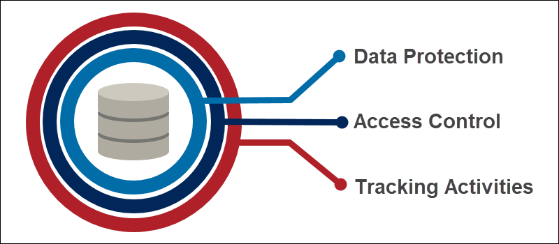

# Database Security Introduction

Welcome to the Database Security Introduction Course. The goal of this training is to provide you with basic understanding of SQL and NO-SQL databases, as well as how to use some basic tools that will help you to effectively and securely manage your organization's most importan asset, your data.

## Assumptions

Even though this is a entry-level course, we strongly recommend learners to take a look to the following resources before initiate with the course/lab section.
* [SQL Intro](https://www.w3schools.com/sql/sql_intro.asp)
* [MySQL Server](https://dev.mysql.com/doc/)
* [MSSQL Queries](https://docs.microsoft.com/es-es/sql/t-sql/queries/queries?view=sql-server-ver15)
* [Oracle Database Doc](https://docs.oracle.com/en/database/)
* [Oracle DBSat](https://www.oracle.com/database/technologies/security/dbsat.html)
* [MongoDB](https://docs.mongodb.com/)
* [Docker](https://docs.docker.com/engine/install/)
* [Introduction to Python](https://www.python.org/about/gettingstarted/)

# What's data security?

When we talk about data security we refer to the protective measures employed to secure data against unauthorized access and to preserve the Information Security Pillars for data confidentiality, integrity, and availability. Data security best practices include data protection techniques such as data encryption, key management, data redaction, data subsetting, and data masking, as well as privileged user access controls and auditing and monitoring.

# The importance of data security

Data is one of the most important assets for any organization. As such, it is paramount to safeguard data from any and all unauthorized access. Data breaches, failed audits, and failure to comply with regulatory requirements can all result in reputational damage, loss of brand equity, compromised intellectual property, and fines for noncompliance. Under the European Union General Data Protection Regulation (GDPR), data breaches can lead to fines of up to 4% of an organization’s global annual revenue, often resulting in significant financial loss. Sensitive data includes personally identifiable information, financial information, health information, and intellectual property. Data must be protected to help avoid a data breach and to help achieve compliance.

# Data Security and GDPR

Data masking, data subsetting, and data redaction are techniques for reducing exposure of sensitive data contained within applications. These technologies play a key role in addressing anonymization and pseudonymization requirements associated with regulations such as EU GDPR. The European Union GDPR was built on established and widely accepted privacy principles, such as purpose limitation, lawfulness, transparency, integrity, and confidentiality. It strengthens existing privacy and security requirements, including requirements for notice and consent, technical and operational security measures, and cross-border data flow mechanisms. In order to adapt to the new digital, global, and data-driven economy, the GDPR also formalizes new privacy principles, such as accountability and data minimization.

Under the General Data Protection Regulation (GDPR), data breaches can lead to fines of up to four percent of a company’s global annual turnover or €20 million, whichever is greater. Companies collecting and handling data in the EU will need to consider and manage their data handling practices including the following requirements:

    Data Security. Companies must implement an appropriate level of security, encompassing both technical and organizational security controls, to prevent data loss, information leaks, or other unauthorized data processing operations. The GDPR encourages companies to incorporate encryption, incident management, and network and system integrity, availability, and resilience requirements into their security program.
    Extended rights of individuals. Individuals have a greater control—and ultimately greater ownership of–their own data. They also have an extended set of data protection rights, including the right to data portability and the right to be forgotten.
    Data breach notification. Companies have to inform their regulators and/or the impacted individuals without undue delay after becoming aware that their data has been subject to a data breach.
    Security audits. Companies will be expected to document and maintain records of their security practices, to audit the effectiveness of their security program, and to take corrective measures where appropriate.

For further reference, you can read  the following article: *[What is data Security?](https://www.oracle.com/es/security/database-security/what-is-data-security/)*
